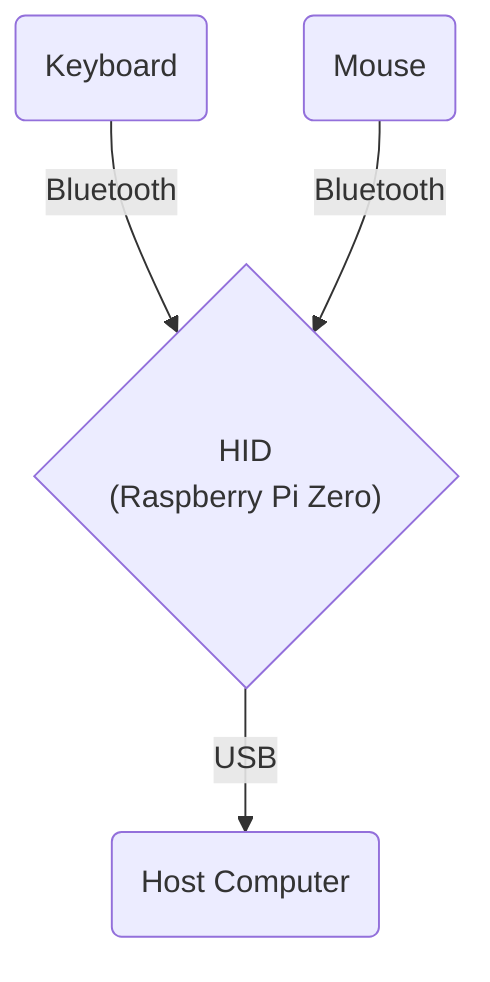

# Bluetooth USB HID Relay

This project creates a Bluetooth USB HID relay using a Raspberry Pi Zero. It allows you to use Bluetooth keyboards and mice with computers that have Bluetooth disabled, by presenting the Raspberry Pi as a composite USB HID device.

## Inspiration

This project was inspired by a friend who couldn't use his favorite Bluetooth mouse and keyboard due to Bluetooth being disabled on his work laptop. The Raspberry Pi Zero acts as a bridge, connecting to Bluetooth peripherals and presenting itself as a USB HID device to the computer.

## Features

- Connects to Bluetooth keyboards and mice
- Presents itself as a composite USB HID device (keyboard and mouse) to the host computer
- Works with both Windows and Mac computers
- Uses DietPi as the operating system for a lightweight setup
- Automatically starts the relay service at boot
- Configures Raspberry Pi Zero as a USB OTG device
- Includes a script to help pair Bluetooth devices

## Components

- Raspberry Pi Zero
- DietPi operating system
- Bash scripts for setup and configuration
- Go program for handling Bluetooth input and USB HID output
- Systemd service for automatic startup

## Setup

1. Install DietPi on your Raspberry Pi Zero.
2. Clone this repository to your Raspberry Pi.
3. Run the setup scripts in the following order:

   ```
   sudo ./scripts/setup_usb_host.sh
   sudo reboot
   sudo ./scripts/setup_bluetooth.sh
   sudo ./scripts/setup_gadgets.sh
   ```

4. Compile the Go program:

   ```
   go build -o bt-hid-relay main.go
   ```

5. Set up the systemd service:

   ```
   sudo ./scripts/setup_service.sh
   ```

6. Pair your Bluetooth devices:
   ```
   sudo ./scripts/pair_devices.sh
   ```
   You will be prompted to enter the MAC addresses of your keyboard and mouse. Make sure you have these addresses ready before running the script.

## Usage

1. Power on your Raspberry Pi Zero and connect it to the target computer via USB.
2. If you haven't paired your Bluetooth keyboard and mouse yet, run the pairing script:
   ```
   sudo ./scripts/pair_devices.sh
   ```
   Follow the prompts to pair your devices.
3. The Raspberry Pi will now relay input from the Bluetooth devices to the target computer.

## Development

This project serves as a learning opportunity for:
- Linux internals
- Creating USB gadgets
- Using Go for hardware interfacing
- Setting up systemd services
- Configuring Raspberry Pi Zero as a USB OTG device
- Bluetooth device pairing and management

## References

- [Adafruit Guide: Turning your Raspberry Pi Zero into a USB Gadget](https://cdn-learn.adafruit.com/downloads/pdf/turning-your-raspberry-pi-zero-into-a-usb-gadget.pdf)

## License

This project is licensed under the MIT License - see the [LICENSE](LICENSE) file for details.

## Project Structure

- `cmd/bt-verify/main.go`: A simple program to verify Bluetooth device connection and echo their inputs.
- `cmd/bt-relay/main.go`: The main program for relaying Bluetooth input to a USB HID device.
- `scripts/`: Helper scripts for system setup and Bluetooth device pairing.

## Verifying Bluetooth Devices

To verify the connection of Bluetooth devices and echo their inputs:

```
go run cmd/bt-verify/main.go
```

