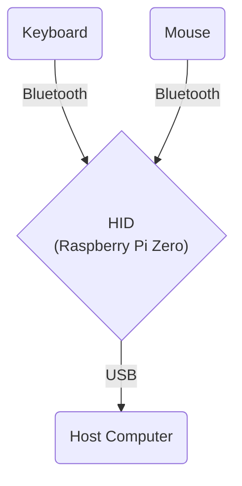

# Bluetooth USB HID Relay

### A delightfully over-engineered solution to an unusual modern problem! 
Use Bluetooth peripherals with Bluetooth-disabled computers.

This project creates a Bluetooth USB HID relay using a Raspberry Pi Zero (or similar OTG-enabled single-board computer). It allows you to use Bluetooth keyboards and mice with computers that have Bluetooth disabled, by presenting the board as a composite USB HID device.

## Inspiration

This project was born out of a desire to help a friend who couldn't use his favorite Bluetooth mouse and keyboard due to Bluetooth being disabled on his work laptop. As someone who enjoys tinkering and problem-solving, I saw this as an opportunity to create something useful while learning more about Linux internals, USB gadgets, and Go programming. The Raspberry Pi Zero became the perfect bridge, connecting Bluetooth peripherals to computers that wouldn't normally allow it.



## Features

- Connects to Bluetooth keyboards and mice
- Presents itself as a composite USB HID device (keyboard and mouse) to the host computer
- Works with Windows, Mac, and Linux computers
- Automatically starts the relay service at boot
- Configures the board as a USB OTG device
- Includes a script to help pair Bluetooth devices

## Components

- Raspberry Pi Zero or other single-board computer capable of USB OTG
- DietPi or another lightweight Linux distribution
- Bash scripts for setup and configuration
- Go program for handling Bluetooth input and USB HID output
- Systemd service for automatic startup

## Prerequisites

Before building and running the project, ensure you have the following installed:

1. Go (version 1.21 or later)

   On most Linux distributions, including Raspberry Pi OS (formerly Raspbian), you can install Go using:

   ```bash
   sudo apt-get update
   sudo apt-get install golang
   ```
2. Task runner using:

   ```bash
   sh -c "$(curl --location https://taskfile.dev/install.sh)" -- -d -b ~/.local/bin
   ```

   or

   ```bash
   go install github.com/go-task/task/v3/cmd/task@latest
   ```
> Note: You may need to add $(go env GOPATH)/bin to your PATH environment variable with the second command.

## Setup

1. Log in to your Raspberry Pi Zero.
2. Clone this repository to your board.
3. Run the setup scripts in the following order:

   ```bash
   sudo ./scripts/setup_usb_host.sh
   sudo reboot
   sudo ./scripts/setup_bluetooth.sh
   sudo ./scripts/setup_gadgets.sh
   ```

5. Pair your Bluetooth devices manually or using the script:
   ```bash
   sudo ./scripts/pair_devices.sh
   ```

4. Build and install the service:
   ```bash
   task build
   sudo task service:install
   ```

## Usage

Connect the board to the target computer via USB. This will turn the board on and start the service automatically (assuming it was installed and enabled using the steps above) the bluetooth peripherals should connect automatically as well and the service will retry if they are not connected momentarily. Both Windows and MacOS have been tested and should work.

## Tasks

This project uses Task runner for common operations:

### General tasks
- `task --list` - List all available tasks
- `task build` - Build the project
- `task clean` - Clean build artifacts
- `task test` - Run tests
- `task run` - Build and run the application

### Service Management
- `task service:install` - Install and enable the service
- `task service:status` - Check service status
- `task service:logs` - View service logs
- `task service:restart` - Restart the service
- `task service:start` - Start the service
- `task service:stop` - Stop the service
- `task service:uninstall` - Remove the service

## Verifying Bluetooth Devices (WIP)

To verify the connection of Bluetooth devices and echo their inputs:

```bash
task verify
```

## Development

This project can be used as is or as basis for other types of USB gadgets. It can also serve as a learning opportunity for:
- Linux internals
- Creating USB gadgets
- Using Go for hardware interfacing
- Setting up systemd services
- Configuring single-board computers as USB OTG devices
- Bluetooth device pairing and management

It's been a fun journey of discovery, and I hope others find it useful or inspiring for their own projects!

## Compatibility

Tested with DietPi 64bit as host and Windows 10 and MacOS USB clients to which the keyboard and mouse were connected. No issues with latency or input delay. My friend have been using this setup for a few days now and it works great.

## References

- [Adafruit Guide: Turning your Raspberry Pi Zero into a USB Gadget](https://cdn-learn.adafruit.com/downloads/pdf/turning-your-raspberry-pi-zero-into-a-usb-gadget.pdf)
- [Composite USB Gadgets on the Raspberry Pi Zero](https://www.isticktoit.net/?p=1383)
- [Task: A task runner / simpler Make alternative](https://taskfile.dev)

## License

This project is licensed under the MIT License - see the [LICENSE](LICENSE) file for details.
