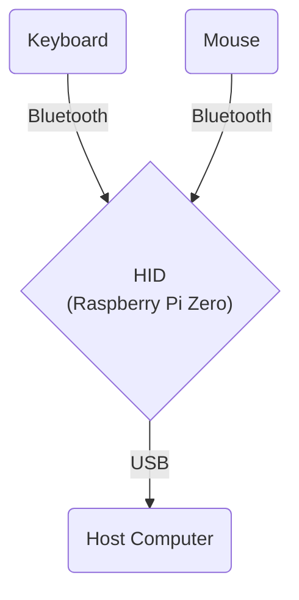

# Bluetooth USB HID Relay

This project creates a Bluetooth USB HID relay using a Raspberry Pi Zero (or similar single-board computer). It allows you to use Bluetooth keyboards and mice with computers that have Bluetooth disabled, by presenting the board as a composite USB HID device.

## Inspiration

This project was born out of a desire to help a friend who couldn't use his favorite Bluetooth mouse and keyboard due to Bluetooth being disabled on his work laptop. As someone who enjoys tinkering and problem-solving, I saw this as an opportunity to create something useful while learning more about Linux internals, USB gadgets, and Go programming. The Raspberry Pi Zero became the perfect bridge, connecting Bluetooth peripherals to computers that wouldn't normally allow it.



## Features

- Connects to Bluetooth keyboards and mice
- Presents itself as a composite USB HID device (keyboard and mouse) to the host computer
- Works with Windows, Mac, and Linux computers
- Automatically starts the relay service at boot
- Configures the board as a USB OTG device
- Includes a script to help pair Bluetooth devices

## Components

- Raspberry Pi Zero or other single-board computer capable of USB OTG
- DietPi or another lightweight Linux distribution
- Bash scripts for setup and configuration
- Go program for handling Bluetooth input and USB HID output
- Systemd service for automatic startup

## Setup

1. Install DietPi (or your chosen Linux distribution) on your Raspberry Pi Zero or similar board.
2. Clone this repository to your board.
3. Run the setup scripts in the following order:

   ```
   sudo ./scripts/setup_usb_host.sh
   sudo reboot
   sudo ./scripts/setup_bluetooth.sh
   sudo ./scripts/setup_gadgets.sh
   ```

4. Compile the Go program:

   ```
   go build -o bin/bt-hid-relay cmd/bt-hid-relay/main.go
   ```

5. Set up the systemd service:

   ```
   sudo ./scripts/setup_service.sh
   ```

6. Pair your Bluetooth devices:
   ```
   sudo ./scripts/pair_devices.sh
   ```
   You will be prompted to select your keyboard and mouse from the list of available devices.

## Usage

1. Power on your board and connect it to the target computer via USB.
2. If you haven't paired your Bluetooth keyboard and mouse yet, run the pairing script:
   ```
   sudo ./scripts/pair_devices.sh
   ```
   Follow the prompts to pair your devices.
3. The board will now relay input from the Bluetooth devices to the target computer.

## Verifying Bluetooth Devices

To verify the connection of Bluetooth devices and echo their inputs:

```
go run cmd/bt-verify/main.go
```

## Development

This project serves as a learning opportunity for:
- Linux internals
- Creating USB gadgets
- Using Go for hardware interfacing
- Setting up systemd services
- Configuring single-board computers as USB OTG devices
- Bluetooth device pairing and management

It's been a fun journey of discovery, and I hope others find it useful or inspiring for their own projects!

## References

- [Adafruit Guide: Turning your Raspberry Pi Zero into a USB Gadget](https://cdn-learn.adafruit.com/downloads/pdf/turning-your-raspberry-pi-zero-into-a-usb-gadget.pdf)
- [Composite USB Gadgets on the Raspberry Pi Zero](https://www.isticktoit.net/?p=1383)

## License

This project is licensed under the MIT License - see the [LICENSE](LICENSE) file for details.

## Building, Installing, and Running the Project

This project uses a Makefile for common tasks. Here are the available commands:

- Build the project: `make build`
- Clean build artifacts: `make clean`
- Run tests: `make test`
- Build and run the application: `make run`

For installing and uninstalling the service, you need to use sudo:

- Install the service: `sudo make install`
- Uninstall the service: `sudo make uninstall`

For example, to build the project:

```
make build
```

To install the service:

```
sudo make install
```

This ensures that the necessary files are copied to system directories and the service is properly registered with systemd.

## Prerequisites

Before building and running the project, ensure you have the following installed:

1. Go (version 1.21 or later)
2. Make

On most Linux distributions, including Raspberry Pi OS (formerly Raspbian), `make` is usually pre-installed. However, if it's not available, you can install it using:

```
sudo apt-get update
sudo apt-get install
```
